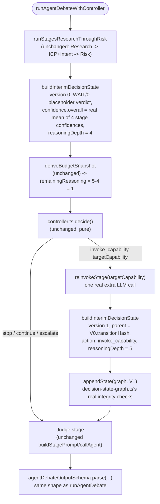

# ARGUS v4 — Adaptive Decision Operating System

Architecture North Star, frozen 2026-07-24. This document captures a
refinement of the existing v4 architecture, not a new version — see
"Naming" below. It exists to give future work (this repo's or a future
engineer's) a stable reference for what ARGUS is trying to be, independent
of which model or agent framework happens to implement it this year.

## Naming

Stays **v4**. Nothing here changes the architecture that's already been
built across Phases 0–10 (eval harness, LLM provider abstraction, Decision
Value, Evidence Graph, Conflict Surprise Score, Retriever Registry, Policy
versioning, Routing Optimizer, Learning Wiring, the 3-candidate benchmark).
Everything below is a refinement layered on top of that, using the same
"extend, don't replace" discipline the whole v4 roadmap has followed.

## North Star

> **Maximize decision value by spending only the reasoning necessary for
> the expected benefit.**

This supersedes the earlier framing ("spend the minimum reasoning required
to make the correct decision"). The refinement matters because "correct"
and "economically optimal" aren't always the same thing — a change that
improves accuracy 98.2% → 98.3% at 10x the cost is not a change ARGUS
should make. Decision Value (built, Phase 2) is the mechanism that already
captures this trade-off; the sections below describe wiring it in as the
actual optimization target rather than a metric that's only logged.

## One-sentence description

> ARGUS is an adaptive Decision Operating System that continuously learns
> the minimum reasoning required to maximize decision value for each
> organization.

Deliberately silent on multi-agent, Claude, debate, or graphs — those are
implementation details that should be free to change without this
sentence becoming false.

## Conceptual flow (target state)

```
Organization
     |
     v
Knowledge Assets (Evidence * Policies * Memory * Patterns)
     |
     v
Decision Complexity Engine
     |
     v
Execution Strategy Registry
     |
     v
Reasoning Engine (single_pass / micro_debate / executive_debate)
     |
     v
Decision
     |
     v
Outcome
     |
     v
Learning Engine
     |
     v
Reasoning Asset Evolution
     |
     +--> feeds back into Knowledge Assets
```

## Status of each stage against what's actually built

| Stage | Status | Where |
|---|---|---|
| Knowledge Assets | Partial | `EvidenceEdge` (Phase 3), `CompanyMemory`, `PolicyDefinition`/`PolicyVersion` (Phase 5) exist as separate models; `ReasoningAsset` (Phase 13) can now register a metadata entry against any of them, but nothing auto-registers or auto-scores one yet |
| Decision Complexity Engine | Built | [decision-complexity.ts](../apps/api/src/agents/complexity/decision-complexity.ts) computes cv/directional/maxSurprise and a weighted composite score; `DecisionComplexityWeights` (Phase 12) versions the weights via admin-triggered recompute from real labeled decision/outcome history. Not wired into any routing decision yet — see caveat below |
| Execution Strategy Registry | Built | [execution-strategy.ts](../apps/api/src/agents/routing/execution-strategy.ts) — `EXECUTION_STRATEGY_REGISTRY`, an ordered list of strategy definitions (Phase 11) |
| Reasoning Engine | Built | [orchestrator.ts](../apps/api/src/agents/orchestrator.ts)'s 5-agent pipeline; Phase 9's benchmark is evaluating single-call and conflict-augmented alternatives against it; Phase 16 added a prompt-construction/caching layer (`buildStagePrompt`, `DecisionContextBuilder`, `USE_KNOWLEDGE_PACK` shadow observation), off by default |
| Decision / Outcome | Built | `decision.service.ts` / `outcome.service.ts` |
| Learning Engine | Built (human-in-the-loop only — see Decision 3 below) | `learning.service.ts`, `LearningRecommendation` (PENDING/ACTIONED/DISMISSED) |
| Decision Value as optimization target | Partial | `decision-value.service.ts` computes Decision Value and Decision Value/$ (used in Phase 9's benchmark metrics); not yet wired into the Routing Optimizer's actual routing decision |
| Reasoning Asset | Built (metadata wrapper, not a shared base table) | [reasoning-asset.service.ts](../apps/api/src/modules/reasoning-assets/reasoning-asset.service.ts) — registers any of the 7 asset kinds by (assetType, assetKey); effectivenessScore stays null until a real evaluation is recorded, never auto-computed (Phase 13) |

**Important caveat on Execution Strategy and Decision Complexity**: the
registry (Phase 11) makes the *selection* of a strategy name inspectable
and extensible, and the Decision Complexity Engine (Phase 12) can now
produce a real, versioned, learned score. Neither is wired into
`orchestrator.ts` — nothing there branches on `ExecutionStrategy` or
`calculateComplexityScore`'s output to actually run fewer or more debate
rounds. Both are computed but uncalled from the live decision pipeline.
Wiring either into real orchestration behavior is a separate, larger task
against `orchestrator.ts` itself and needs its own explicit go-ahead before
it's built, given how central that file is to every live decision made
today.

## Decisions locked by this freeze

1. **No v5 rename.** Everything above is v4.
2. **Decision Complexity Engine's thresholds are bootstrapping defaults,
   not permanent architecture.** They're expected to become a versioned,
   per-team weighted model — reusing the same `RoutingThresholdVersion`
   -style approval workflow already built for Phase 6 — rather than
   staying hardcoded forever.
3. **Execution Strategy enum values become Strategy Registry entries.**
   Policies select strategies; strategies (eventually) implement behavior.
4. **Decision Value / Reasoning Cost becomes the framing for any future
   routing decision**, not just a metric that gets logged after the fact.
5. **The organizational learning loop is wider than currently built:**
   Decision → Outcome → Knowledge → Policy → Retriever → Routing →
   Complexity → next Decision, not the narrower Decision → Outcome →
   Retriever/Policy loop built so far.
6. **"Reasoning Asset"** (Policy, Evidence, Pattern, Retriever, Threshold,
   Prompt, Strategy — each versioned, owned, approved, and tracked for
   effectiveness) is the target unifying abstraction for the Learning
   Engine. Planned (Phase 13), not yet built — no code today unifies these
   under one model.

## How Phase 12, 13, and 16 resolved their own open questions

All three were built. The choices made, for the record:

- **Phase 12 (Decision Complexity weight-learning):** feature set stayed at
  the 3 already-computed signals (cv, directional, maxSurprise) — evidence
  quality and novelty were explicitly left out, since neither has a real
  computation anywhere in the codebase and fabricating one wasn't in scope.
  Re-weighting is admin-triggered only (no scheduled job, no fixed decision
  count) — `POST /api/v1/complexity/weights/recompute`. `RoutingThresholds`
  was left completely untouched; `DecisionComplexityWeights` is a new,
  separate, additive table, not a replacement.
- **Phase 13 (Reasoning Asset):** built as a metadata wrapper, not a shared
  base table — `ReasoningAsset` references any of the 7 asset kinds by
  `(assetType, assetKey)` rather than a single foreign key, since 3 of them
  (Retriever, Prompt, Strategy) are still pure code with no DB row to point
  to. Existing tables (Policy/Evidence/Threshold/Weights) keep their own
  schemas and approval workflows untouched.
- **Phase 16 (Knowledge Pack / prompt-caching foundation, Days 1–5):** an
  external "Compiler-Based Knowledge Flow" proposal (`KnowledgePackCompiler`
  → `ContextCompiler` → `PromptRenderer` classes, `ReasoningAsset` as a
  content store) didn't match the real codebase — `ReasoningAsset` (Phase
  13) is a metadata registry, not content, and prompt construction was
  never one wrappable `buildPrompt()` call but 5 separate inline call
  sites in `orchestrator.ts`. Rebuilt against the real code instead:
  - **Day 1** — [`buildStagePrompt`](../apps/api/src/agents/orchestrator.ts)
    (typed `StageId`, not a raw `string`): extracts the 5 call sites'
    `systemPromptFor()` + `fillPlaceholders()` pairs into one helper.
    Zero behavior change — same two functions, same order, same output.
  - **Day 2** — [`decision-context-builder.ts`](../apps/api/src/agents/decision-context-builder.ts):
    centralizes the `DecisionAgentInput` shaping logic `decision.service.ts`
    used to inline, typed off the real repository functions' own return
    types. `decision.service.ts`'s `Promise.all` fetch stays the
    authoritative source of decision inputs, unchanged. Adds
    `hashKnowledgeFields()` — canonical (sorted-key) SHA-256 over only the
    genuinely team-level fields (`teamIcp`, `companyMemory`, `teamHistory`,
    `userPreferences`, `teamPatterns`); `prospectData` and the two
    per-prospect fields (`intentSignals`, `historicalEngagement`) are
    excluded regardless of how little they varied across the 51 eval
    fixtures (Phase 15) — that low variance is a fixture-generation
    artifact, not evidence of real cross-decision sharing.
  - **Day 3** — [`prompt-cache-key.ts`](../apps/api/src/agents/prompt-cache-key.ts):
    `buildPromptCacheKey(stageName, promptTemplate, knowledgeHash)`, built
    entirely outside `buildStagePrompt` — prompt construction owns zero
    hashing. Uses a content hash of the prompt template itself as the
    "did the wording change" component rather than a manually-maintained
    version string, so any `prompts.ts` edit invalidates the key
    automatically instead of depending on a developer remembering to bump
    a number.
  - **Day 4** — [`eval/snapshot-prompt-migration.ts`](../apps/api/eval/snapshot-prompt-migration.ts):
    proved `buildStagePrompt`'s output byte-identical to the pre-Day-1
    construction across all 51 fixtures × 5 stages (255/255 real
    comparisons against real fixtures, not asserted from the diff).
  - **Day 5** — [`prompt-cache-shadow.ts`](../apps/api/src/agents/prompt-cache-shadow.ts),
    gated by `USE_KNOWLEDGE_PACK` (`env.ts`, default `false`):
    shadow-observes real decisions and flags the one remaining
    unvalidated invariant — does the same `(stage, promptHash,
    knowledgeHash)` cache key ever produce a different rendered prompt?
    `runAgentDebate`'s real call is never altered, skipped, or
    short-circuited by the flag.

  **Deliberately not done**, per the plan's own "no more design" and
  "not yet" framing: no `KnowledgePack` DB table, no Redis-backed prompt
  cache, no production cutover. `USE_KNOWLEDGE_PACK` has shipped to
  `main` but stays off by default until real shadow-observation data
  from a parallel-run period justifies turning it on.

## Controller & Capability Specification v3.0

A separate, more ambitious external spec proposed an "Adaptive Reasoning
Platform" — `DecisionState` graphs, a `BudgetManager`, capability-advisory
outputs, a `PlanningPolicy`/Controller loop, `DecisionPack` domain
generalization, and online/offline learning. A gap analysis against the
real codebase found **zero** of its 8 core components already
implemented, and — the load-bearing finding — the entire architecture
presupposes an iterative reasoning loop that doesn't exist: the live
pipeline ([orchestrator.ts](../apps/api/src/agents/orchestrator.ts)) is
still a fixed, single-pass, 5-stage sequence with no "round 2." Everything
built below is scoped narrower than the spec's own phasing as a result,
following this session's "validate every architectural assumption
against reality, never force the code to match the document" rule.

- [`decision-state.ts`](../apps/api/src/agents/decision-state.ts) —
  `DecisionState` as a purely additive, shadow-only audit record (gated by
  `RECORD_DECISION_STATE`, default `false`). Real fields (verdict,
  confidence, disagreements, `RawCost` budget) are honestly separated from
  fields with no real data source yet (evidence graph, `reasoningHistory`,
  `controllerMemory`, objective's time-horizon/decay) rather than
  fabricated. Always produces version 0 — there's no round 2 to produce a
  version 1 from.
- [`budget-manager.ts`](../apps/api/src/agents/budget-manager.ts) —
  `normalizeCost`/`denormalizeCost`/`allocate` only; no `consume()` or
  `evaluateReallocation()`, since nothing spends a budget mid-decision yet.
  `denormalizeCost` is explicitly documented as *not* a true inverse of
  `normalizeCost` (a 3-term sum can't be uniquely decomposed).
- [`reasoning-capability.ts`](../apps/api/src/agents/reasoning-capability.ts) —
  the `ReasoningCapability`/`CapabilityOutput`/`CapabilityAdvisory` plug-in
  contract, proven against something real (the existing, still-unwired
  Retriever Registry, Phase 4) via `wrapRetrieverAsCapability`, rather than
  left as bare types.
- [`expected-utility.ts`](../apps/api/src/agents/expected-utility.ts) —
  the five-term Expected Utility function (`Gain − Loss − Delay −
  ReasoningCost − RiskPenalty`) as pure functions over one real
  `DecisionState`. Three terms are fully real (Gain, Loss, ReasoningCost);
  Delay and RiskPenalty are honest zeros against real data today (no
  per-decision time-decay rate or disagreement severity score exists
  anywhere in ARGUS), each proven correct against synthetic states with
  real-shaped data for when that data eventually exists.
- [`controller.ts`](../apps/api/src/agents/controller.ts) — the full
  stop/continue/invoke_capability/escalate `decide()`, built as a **pure
  policy function** over `(DecisionState, BudgetSnapshot,
  CapabilityOutputsByStage?, ControllerPolicy) -> ControllerDecision`, per
  explicit design direction: it has no knowledge of the orchestrator, no
  knowledge of how a `BudgetSnapshot` or `CapabilityOutputsByStage` was
  built, and performs no execution — the signature is already the "steer a
  decision in progress" shape, so it won't need to change on the day a real
  Controller loop starts calling it mid-decision instead of only after one
  completes. `ControllerDecision` carries `reasons: string[]` (independent,
  named statements — built for debugging/replay/analytics, never one
  concatenated sentence) and, for `invoke_capability`, a `targetCapability`
  naming the real weakest-confidence capability. `continue` and
  `invoke_capability` are governed by explicit, separate policy branches
  (never a residual "else, so continue" default) — decide() is also
  deterministic (same inputs → same output every time, tested explicitly).
  No oscillation/progress detection yet (needs real multi-round history
  that doesn't exist). Against real data today, `decide()` always returns
  `"stop"`: `budget-manager.ts`'s new `deriveBudgetSnapshot()` computes
  `remainingReasoning` as `5 − raw.reasoningDepth`, and every real decision's
  `reasoningDepth` is always 5 (the fixed pipeline's own real step count) —
  so `remainingReasoning` is always exactly 0, and the budget-exhausted
  branch fires before confidence or capability-targeting logic is ever
  reached. `continue`/`invoke_capability` are real and reachable (proven in
  `controller.test.ts` against synthetic `BudgetSnapshot`/
  `CapabilityOutputsByStage`) but stay dormant until a real Controller loop
  can actually afford a next step — a real, deterministic finding, not a
  bug.
- [`decision-pack.ts`](../apps/api/src/agents/decision-pack.ts) — engineering
  scaffolding only, per explicit scope: formalizes the one real domain
  (`SALES_LEAD_QUALIFICATION_PACK`) ARGUS implements today, with every
  field referencing already-real prompts/schemas/constants. No second
  domain invented — whether ARGUS ever supports one (e.g. recruiting)
  remains an open product decision. `deriveDecisionPack()` demonstrates
  "inheritance" as plain object override, proven against a synthetic test
  pack, not a real second vertical.
- [`decision-state-shadow.ts`](../apps/api/src/agents/decision-state-shadow.ts) —
  ties the above together: for every real, shadow-captured decision, also
  derives a real `BudgetSnapshot` (`budget-manager.ts`'s
  `deriveBudgetSnapshot`), computes the real Expected Utility breakdown, and
  calls the full `controller.ts` `decide()` — now with real
  `CapabilityOutputsByStage` threaded in from `decision.service.ts` (which
  computes capability outputs once, then passes them to both
  `capability-shadow.ts`'s own log and this call), so `invoke_capability`'s
  targeting logic sees real per-stage confidence rather than an artificially
  withheld `undefined`. Still purely observational, same flag, zero
  behavior change.
- [`capability-shadow.ts`](../apps/api/src/agents/capability-shadow.ts) —
  not "capability selection" (nothing selects; the pipeline is fixed, so
  all 4 real retriever capabilities always run) but real per-capability
  output against a real evidence pool
  ([`getEvidenceForProspect`](../apps/api/src/modules/decisions/decision.repository.ts),
  genuinely empty for a prospect with no prior decisions). Same
  `RECORD_DECISION_STATE` flag, same zero-behavior-change guarantee —
  confirmed by real log output showing correct non-zero confidence for a
  populated pool and all-zero for an empty one.
- [`decision-state-graph.ts`](../apps/api/src/agents/decision-state-graph.ts) —
  the multi-version `DecisionStateGraph` runtime abstraction (`createDecisionStateGraph`,
  `getRootState`/`getCurrentState`/`getStateAtVersion`/`getPath`, `appendState`
  with real hash-chain and version integrity checks), immutable per Decision
  State's own frozen invariant. `getBranchPoint`/`replay`/`branchAt` deliberately
  deferred — no design decision yet for what a "branch" means for ARGUS. Every
  real graph today has exactly one node (version 0, no parent); multi-version
  logic proven against synthetic-but-contract-valid states built from a real root.
- [`advisory-scoring.ts`](../apps/api/src/agents/advisory-scoring.ts) —
  Section 3.3/3.4's advisory scoring math: `priorityWeight()` (the spec's own
  fixed lookup) and `scoreRecommendedAction()` (`expectedConfidenceGain *
  (advisoryConfidence/100) * priorityWeight(priority)`, returning `null` rather
  than defaulting to 0 when `expectedConfidenceGain` is absent — Section 3.4's
  own "cannot be scored without it" constraint). `selectBestAdvisory()`
  aggregates across real `CapabilityOutput`s and is wired into
  `capability-shadow.ts`'s shadow log (`bestAdvisory` field) — honestly `null`
  against real data today, since no real capability emits an `advisory` yet;
  confirmed by real log output. The spec's own `incorporateAdvisories()`
  (comparing an advisory's score against "the Controller's own
  capability-selection score") is deliberately not built — `controller.ts`'s
  real `decide()` has no such score to compare against.

**Deliberately not done** (superseded in part by Execution Runtime v1
below, which executes exactly one real Controller cycle behind a flag):
a real multi-round Controller *loop* (deciding again after a re-invocation,
not just once); oscillation/progress detection (needs real multi-round
history); `ControllerPolicy` training; a second `DecisionPack`; and
Decision State Graph branching (`getBranchPoint`/`replay`/`branchAt`). All
of these need either more real iterative rounds to exist in production or a
product decision that hasn't been made — building any of them now would
mean simulating something that isn't real yet.

## Execution Runtime v1

The Controller & Capability Spec v3.0 work above proved something concrete:
against every real decision, `controller.ts`'s `decide()` always returned
`"stop"`, because `deriveBudgetSnapshot`'s `remainingReasoning` was always
exactly `5 − 5 = 0`. That's not a Controller bug — it's proof the runtime
itself was still shaped like this, with the Controller sitting entirely
*after* the pipeline, never in a position to influence it:


Execution Runtime v1 is the architectural pivot: the Controller moves
*inside* the loop, between real stages, instead of only observing after all
of them finish.

### Runtime interfaces

```ts
// execution-runtime.ts
interface ExecutionIdentity {
  teamId: string;
  userId: string;
  prospectId: string;
  prospectName: string;
}

interface ExecutionRuntimeResult {
  output: AgentDebateOutput;        // identical shape to runAgentDebate's own return
  processingTimeMs: number;
  usage: TokenUsageAccumulator;
  executionTrace: {                 // additive -- existing callers can ignore this
    graph: DecisionStateGraph;
    controllerDecision: ControllerDecision;
  };
}

function runAgentDebateWithController(
  input: DecisionAgentInput,
  identity: ExecutionIdentity,
  policy?: ControllerPolicy,
): Promise<ExecutionRuntimeResult>;
```

Everything `decide()` needs (`DecisionState`, `BudgetSnapshot`,
`CapabilityOutputsByStage`) is built from data this one function already
has in hand — no new persistence, no new service.

### State transition diagram (Phase 1: exactly one real cycle)



Only one cycle runs — after an `invoke_capability` re-run, Judge always
follows next. A second `decide()` call after the re-run (a real loop, not
one cycle) is explicitly future work, not built here.

### Minimal migration plan

1. **Phase 1 (this)** — flagged (`EXECUTION_RUNTIME_V1`, default `false`),
   exactly one controller cycle, real confidence-gap detection from the
   4 stages' own self-reported confidence, real `DecisionStateGraph`
   versioning for the one possible extra stage. Existing pipeline
   (`runAgentDebate`) is untouched and stays the default.
2. **Phase 2 (not built)** — loop the cycle: after an `invoke_capability`
   re-run, call `decide()` again (bounded by `BudgetSnapshot`/policy) instead
   of always proceeding straight to Judge.
3. **Phase 3 (not built)** — let `escalate` and `continue` actually change
   downstream behavior (today both fall through to Judge unchanged — Phase 1
   has no human-handoff delivery mechanism to route `escalate` to, and a
   decision with no verdict at all is worse than one that proceeds).
4. **Phase 4 (not built)** — replace `FIXED_PIPELINE_REASONING_STEPS = 5` as
   the budget metric with a real capability-cost/utility-based one (flagged
   by the user's own review as a deliberate later change, not a Phase 1 gap:
   one expensive capability can cost the same budget as three cheap ones).

### Compatibility strategy

- `agentDebateOutputSchema.parse(...)` validates the final output
  identically on both paths — same schema, same shape. Fixtures/tests are
  unaffected when the flag is off (its default).
- Research/ICP/Intent/Risk/Judge all run through the exact same
  `buildStagePrompt`/`callAgent`/tool/schema/`maxTokens` the fixed pipeline
  already uses — `execution-runtime.ts` calls them, never reimplements them.
- `controller.ts`'s `decide()` is called completely unmodified — this is
  the same pure function `controller.test.ts` already verifies in isolation,
  not a fork of its logic.
- Judge always runs last, on whatever `StageOutputs` resulted (4 originals,
  or 3 originals + 1 real refreshed stage) — never skipped, so every
  decision still gets a real verdict.
- `decision.service.ts`'s only change is a 6-line branch on
  `env.EXECUTION_RUNTIME_V1`; everything after that branch (verdict
  derivation, policy flags, decision-value math, persistence) is completely
  unaware which path ran, since both return the same
  `{output, processingTimeMs, usage}` shape.
- `buildDecisionState`'s existing contract is untouched (`reasoningDepth`
  is a new *optional* field, defaulting to `5`) — every existing call site
  and test keeps its old behavior exactly.

### What's honestly not solved

`buildInterimDecisionState` (`decision-state.ts`) needs a `verdict` field to
exist, but Verdict is an LLM judgment, not a formula this codebase can
compute from partial stage data — there's no real combination of
research/icp/intent/risk's own scores that produces one without fabricating
new business logic. It uses an explicit, documented placeholder (`{label:
"WAIT", confidence: 0}`), which means `ControllerDecision.utilityEstimate`
is not meaningful at the interim checkpoint — only `confidence.overall`
(a real mean of the 4 stages' own confidences), the real `BudgetSnapshot`,
and the real per-capability confidences actually drive `decide()`'s
branching there. Confirmed working end-to-end in
`execution-runtime.test.ts`: a real confidence gap (one stage mocked low,
others high) correctly produces `invoke_capability`, a real second LLM call
for that one stage, a real version-1 `DecisionState` chained onto version 0
via `decision-state-graph.ts`'s own integrity checks, and a final output
that reflects the second call's result, not the first.
